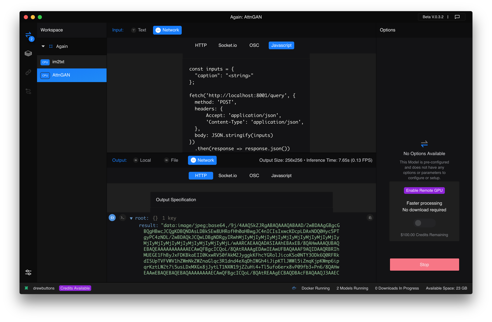
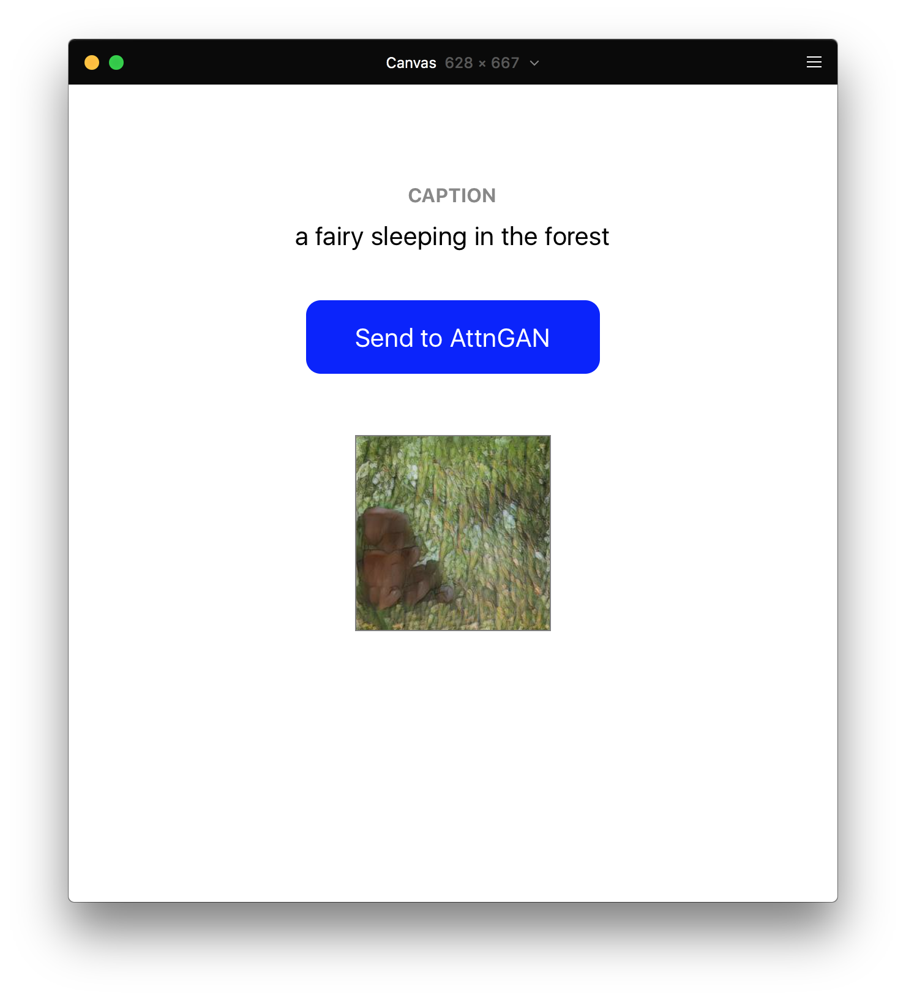

# framer-runway-http-request
This is a simple boilerplate for communicating with Runway machine learning models from Framer Classic.

The project sends a **text caption input** to a pretrained **[AttnGAN](https://github.com/taoxugit/AttnGAN)** model in Runway, which returns a **generated image output**. This format for HTTP requests can be easily adapted to communicate with other models hosted in Runway's library.

Optimized to work in parallel with **Runway v0.3.2**. Last updated **03.04.19**.

# Setup

You will need to have both Runway and Docker installed for this Framer project to work. See [Runway Docs](https://docs.runwayapp.ai/#/) for more setup info.

**Note: Runway is still in Private Beta, so you'll need to [request an invite here](https://runwayapp.ai/).** 

After opening this project in [Framer Classic](https://classic.framer.com/), open Runway and make sure you have AttnGAN installed and running. Runway should look something like this:

<div style="text-align: center">
	
</div>

# Usage

The caption shown at the top of the prototype will be sent to AttnGAN when you click the button. To change the caption, simply update the `testString` variable and refresh.

```coffeescript
testString = "a fairy sleeping in the forest"
```

The function for sending the HTTP POST handles both sending our caption and receiving the generated image output response. Runway automatically assigns a local port to each model you run, so you may need to update `http://localhost:8001/query` depending on what's assigned to AttnGAN on your machine. 

Since the response will be returned as a Promise, we need to convert it to JSON in order to access the data. Once we do that, we can replace the `placeholder` layer's background with the base64 image that Runway returned (it may take a few seconds to complete the request and load the image when we execute the function).

```coffeescript
sendIt = (sendString) ->
	inputs = 
		'caption': sendString
	fetch 'http://localhost:8001/query',
		method: 'POST'
		headers:
			Accept: 'application/json'
			'Content-Type': 'application/json'
		body: JSON.stringify(inputs)
	.then (response) ->
		ganRes = response.json().then (data) ->
			console.log data.result
			ganImg = data.result
			placeHolder.image = ganImg
```

To execute the function, we call it when the button we've drawn is clicked, passing our caption through as an argument.

```coffeescript
bttn.onClick ->
	sendIt(testString)
```

The result should look something like this:

<div style="text-align: center">
	
</div>

# Questions?

Find me on [Twitter](https://twitter.com/drewbuttons).
